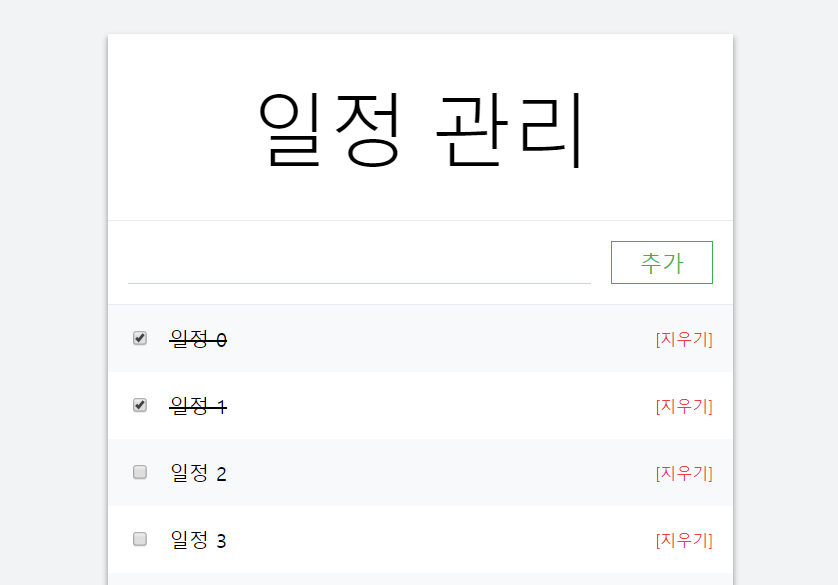

# react-tutorial-todo-list
[](https://github.com/greatfarmer)

Study React!



## Progress
- Chapter 10 | 2018-08-16 ~ 20
- Chapter 11 | 2018-08-20
- Chapter 14 | 2018-08-21 ~ 24

## Quick Start
### To run locally:
```
git clone https://github.com/greatfarmer/react-tutorial-todo-list.git
cd react-tutorial-todo-list
yarn install
yarn start
```

## Reference
- [리액트를 다루는 기술](http://www.gilbut.co.kr/book/bookView.aspx?bookcode=BN002044&page=1&TF=T), 김민준, 길벗 (2018)
